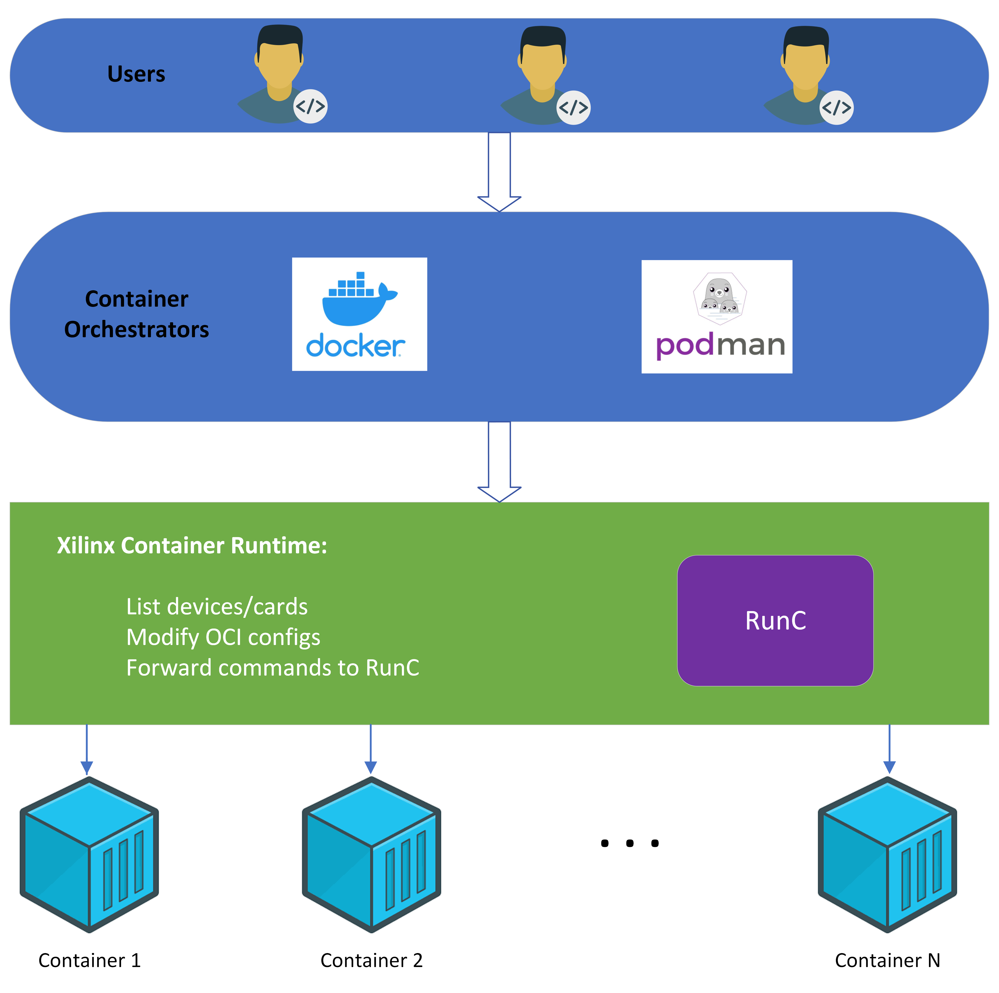

.. 
   Copyright (C) 2019-2021, Xilinx Inc - All rights reserved
  
   Licensed under the Apache License, Version 2.0 (the "License");
   you may not use this file except in compliance with the License.
   You may obtain a copy of the License at
  
       http://www.apache.org/licenses/LICENSE-2.0
  
   Unless required by applicable law or agreed to in writing, software
   distributed under the License is distributed on an "AS IS" BASIS,
   WITHOUT WARRANTIES OR CONDITIONS OF ANY KIND, either express or implied.
   See the License for the specific language governing permissions and
   limitations under the License.

.. meta::
   :keywords: Compute Unit, Kernel, Container, Xiinx Container Runtime
   :description: Xilinx-container-runtime is an extension of runc, with modification to add xilinx devices before running containers.
   :xlnxdocumentclass: Document
   :xlnxdocumenttype: Tutorials

************************
Xilinx Container Runtime
************************
Xilinx-container-runtime is an extension of runc, with modification to add xilinx devices before running containers. Since it is a runC compliant runtime, xilinx container runtime can be integrate with various contianer orchestrators, including docker and podman.

.. toctree::
   :caption: Quick Start
   :maxdepth: 1

   Prerequisites.rst
   Install.rst
   rel.rst

.. toctree::
   :caption: User Guide
   :maxdepth: 1

   cli.rst
   docker.rst
   podman.rst
   singularity.rst

.. toctree::
   :caption: Notice
   :maxdepth: 1

   notice.rst